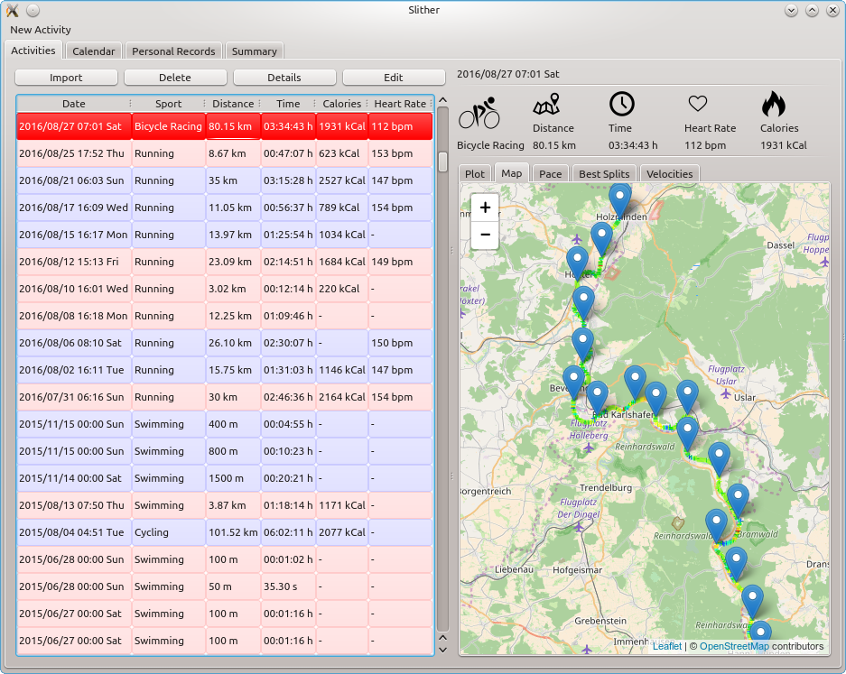

# Slither

A private replacement for online training logs.

## Install

    sudo pip install -r requirements.txt
    # install PyQt4 or PyQt5 + QtSvg + QtWebkit
    # e.g. (Ubuntu 16.04, Python 2.7):
    sudo apt-get install python-pyqt5 python-pyqt5.qtsvg python-pyqt5.qtwebkit
    sudo python setup.py install

Now you can start slither from the command line:

    slither

## Platforms

Slither has been tested with the following platforms:

* Ubuntu 14.04, Python 2.7, 3.4
* Ubuntu 16.04, Python 2.7, 3.5
* Windows 8.1, Python 2.7

## Setup of Remote Data Repository

Slither allows you to set up your own server to share data among clients.
It will be used to share TCX files which can be uploaded and downloaded from
clients. **Note:** there is no support for https yet.

To initialize the remote repository, install slither on a server and start
the slither server:

    slither_server --datadir <directory> --port <port>

You have to enter a username and a password.

Now you can connect from any client with:

    slither --remote <url> --username <username> --password <password>
