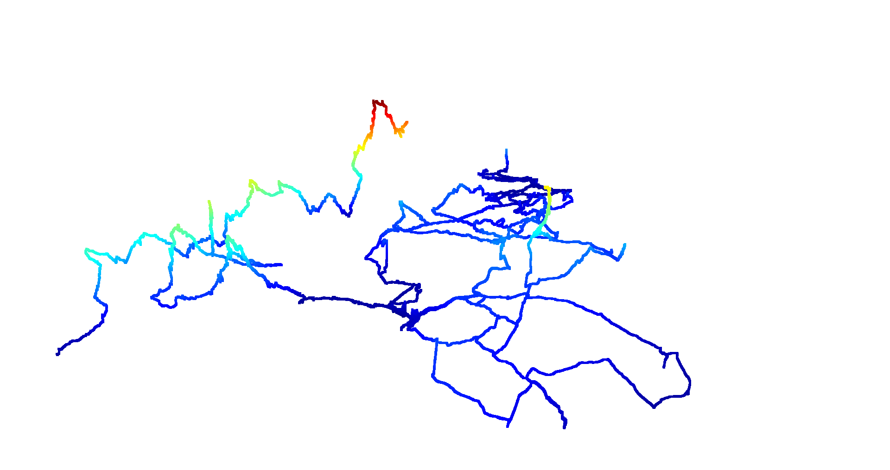
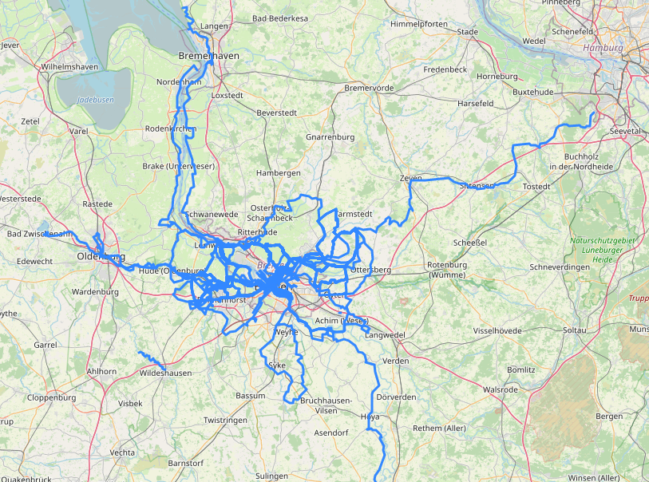

# Slither

A private replacement for online training logs.


You can use slither to keep track of your running, biking, or swimming activities.
You don't need to upload your data to any external service for this. The source
code of slither is completely open source and you can use it to analyse your own
data with Python code.

## Install

    # install PyQt4 or PyQt5 + QtSvg + QtWebkit
    # e.g. (Ubuntu 16.04, Python 2.7):
    sudo apt-get install python-pyqt5 python-pyqt5.qtsvg python-pyqt5.qtwebkit
    # install slither from main directory:
    python setup.py install
    # or with pip:
    pip install -e .

Now you can start slither from the command line:

    slither

## Platforms

Slither has been tested with the following platforms:

* Ubuntu 20.10, Python 3.8
* Ubuntu 16.04, Python 2.7, 3.5
* Ubuntu 14.04, Python 2.7, 3.4
* Windows 8.1, Python 2.7

## Setup of Remote Data Repository

Slither allows you to set up your own server to share data among clients.
It will be used to share TCX files which can be uploaded and downloaded from
clients. **Note:** there is no support for https yet.

To initialize the remote repository, install slither on a server with

    pip install -e .[server]

and start the slither server:

    slither_server --datadir <directory> --port <port>

You have to enter a username and a password.

Now you can connect from any client with:

    slither --remote <url> --username <username> --password <password>

## Examples

Slither gives you full control over your data. All activities and all
GPS data are stored in a simple SQLite database. Take a look at the
[playground](https://github.com/AlexanderFabisch/slither/tree/master/playground)
if you need inspiration.

You can, for example, generate a heatmap from the trackpoints from your
GPS data. Here is an example from two weeks at Mallorca:


Here is the same data with additional (exaggerated) altitude information:



We can also draw a full map with all tracks ever recorded:



Or we can plot the elevation profile of a track:


Another idea for an application would be to check the overall training volume
before a running competition:


It is easy to generate an overview of all activities like this:

```bash
$ python playground/summarize_all.py
                      Activities per Year
┏━━━━━━━━━━┳━━━━━━━━━━┳━━━━━━━━━━━━┳━━━━━━━━━━━━━┳━━━━━━━━━━━━┓
┃ Start    ┃ End      ┃ Activities ┃        Time ┃   Distance ┃
┡━━━━━━━━━━╇━━━━━━━━━━╇━━━━━━━━━━━━╇━━━━━━━━━━━━━╇━━━━━━━━━━━━┩
│ 01/01/20 │ 01/01/21 │        253 │ 256:56:16 h │ 2971.91 km │
│ 01/01/19 │ 01/01/20 │        217 │ 260:19:52 h │ 2974.52 km │
│ 01/01/18 │ 01/01/19 │        190 │ 218:31:01 h │ 2335.04 km │
│ 01/01/17 │ 01/01/18 │        294 │ 296:47:37 h │ 2159.00 km │
│ 01/01/16 │ 01/01/17 │        189 │ 210:39:16 h │ 1778.48 km │
│ 01/01/15 │ 01/01/16 │        244 │ 250:26:08 h │ 1260.91 km │
│ 01/01/14 │ 01/01/15 │         85 │  65:06:07 h │  526.12 km │
│ 01/01/13 │ 01/01/14 │         11 │  00:10:25 h │      950 m │
│ 01/01/12 │ 01/01/13 │         24 │  00:29:46 h │    2.45 km │
│ 01/01/11 │ 01/01/12 │         49 │  02:11:20 h │    9.55 km │
│ 01/01/10 │ 01/01/11 │         28 │  00:43:54 h │    3.60 km │
│ 01/01/09 │ 01/01/10 │         40 │  01:17:44 h │    6.10 km │
│ 01/01/08 │ 01/01/09 │         25 │  00:28:27 h │    2.45 km │
│ 01/01/07 │ 01/01/08 │         45 │  00:36:26 h │    3.25 km │
│ 01/01/06 │ 01/01/07 │         37 │  00:52:45 h │    4.25 km │
│ 01/01/05 │ 01/01/06 │         35 │  00:40:12 h │    3.30 km │
│ 01/01/04 │ 01/01/05 │         37 │  01:20:29 h │    6.05 km │
│ 01/01/03 │ 01/01/04 │         13 │  00:25:41 h │     1850 m │
│ 01/01/02 │ 01/01/03 │         18 │  00:51:41 h │    3.60 km │
└──────────┴──────────┴────────────┴─────────────┴────────────┘
```

Or to analyze workouts individually:

```bash
$ python playground/print_pace_table.py test_data/running.tcx
              Paces
┏━━━━━━━━━━┳━━━━━━━━━━━━━━━━━━━━┓
┃ Distance ┃ Pace (Time per km) ┃
┡━━━━━━━━━━╇━━━━━━━━━━━━━━━━━━━━┩
│    400 m │         00:05:25 h │
│    800 m │         00:05:37 h │
│   1200 m │         00:05:30 h │
│   1600 m │         00:05:37 h │
│     2 km │         00:05:37 h │
└──────────┴────────────────────┘
```

## Slither Core and IO

[](https://codecov.io/gh/AlexanderFabisch/slither)

You don't have to use slither's GUI. `slither.core` and `slither.io` do not
depend on Qt or the domain model of slither. They are general purpose tools
to handle GPS and workout data. The following features are available:

* Data import from
    * GPS exchange format (GPX)
    * Flexible and Interoperable Data Transfer format (FIT)
    * Training Center XML format (TCX)
    * Polar's JSON format
* Data export to TCX
* Data analysis
    * Data cleaning and preprocessing
    * Distance and velocity computation from GPS trackpoints
    * Computation of records (fastest segments for given distances)
    * Computation of paces
    * Elevation statistics
* Visualization
    * Map rendering with Folium
    * Velocity histogram
    * Elevation profile
    * Plot of heartrate and speed over time

You can build the API documentation with `pdoc slither --html --skip-errors`
(requires [pdoc3](https://pdoc3.github.io/pdoc/)).
